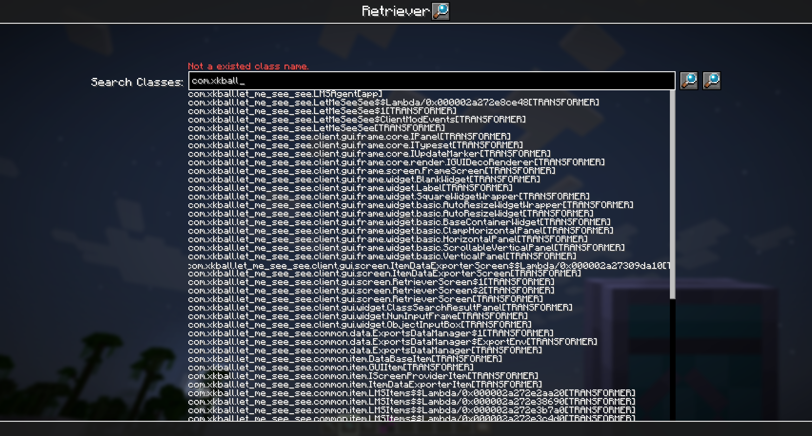
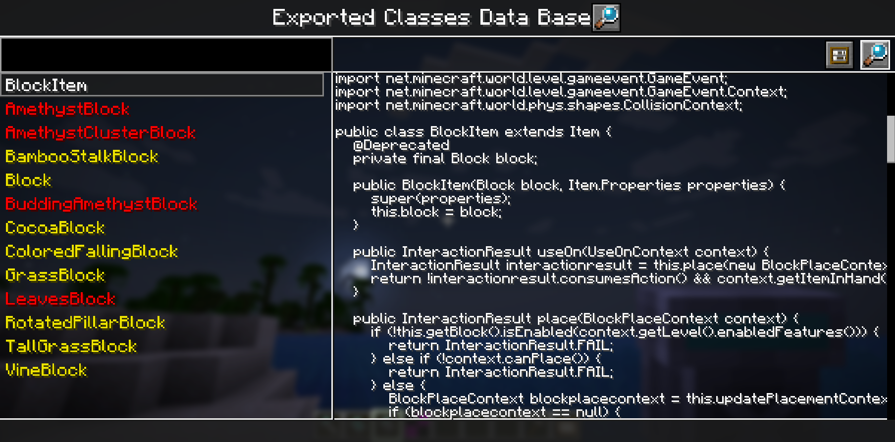
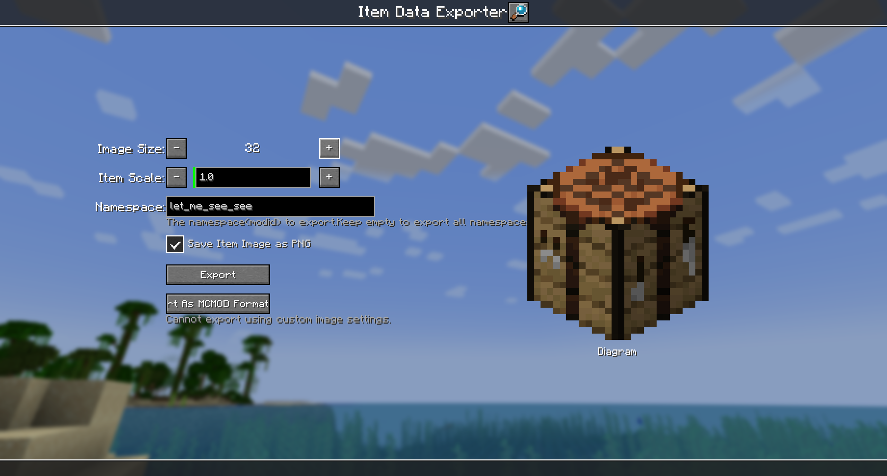

Let Me See See (Your Code)
=======

This mod adds four items to exports java codes of any class and item rendering.

Exproted code include mixin or patch or other modified parts.Can not exports inner classes. You can exprot top level class that contains inner classes.

The mod give out .class file as default. If you set the path of IntellJ IDEA (or other software can open .class file) or java decompiler, this mod can give out .java file and display decompiled java code in game. 

## Items Introducing 

### Scanner

Scanner have no gui, and you an only right click block to use it for now. Scanning item is planning.

Scan a block will detect and export following classes (if exist):

- **The Block class**;
- **The Block Item class**;
- **The Block Entity class**;
- **The Block Entity Renderer class**;

You can view these classes in **Exproted Classes Data Base Item** or in .minecraft/let_me_see_see/(package of class)/(class name).class.

### Retriever

Right click to open a searcher of all loaded classes. Search result contains inner class and lambda or some other generated class, but you can only export top level class.

The search bar ignore word case. Double click any search result to fast complete search bar.

If search bar is filled with the full name of a class(**Must Contains class loader name**, because different class loader can load homonymous classes), click the first button after search bar can exprot the class.

Click the second button after search bar to re-scan loaded classes.

### Exported Classes Data Base

Left panel have a search bar for all exported classes, and listed below are those classes. White class name means it was exported in current game session. Yellow name represent it was exported in past game session. Red name means mod list has changed since export. Relaunch game and change mod list may cause changing of class content.

Upper Right have two buttons for open .class file in IDEA and export class again. Right panel will display decomplied java code after select a class in left side. 

### Item Data Exporter

Export some item data and items rendering by render like them in gui. 

Exported image files under .minecraft/let_me_see_see/_data/(namespace)/(item name).png

Exported item data files under minecraft/let_me_see_see/(namespace).json

